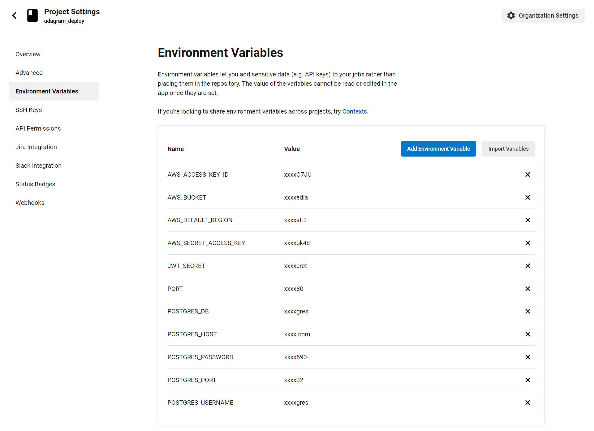
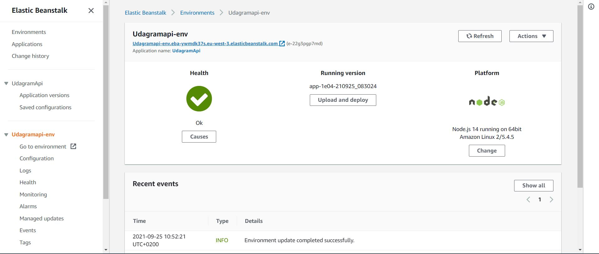

# Udagram

This project is part of the Udacity FullStack JavaScript nanodegree. The code was given as a starter project and the task was to employ and adapt the code to get it working and hosted on AWS.

The project is available at

http://udagramfront.s3-website.eu-west-3.amazonaws.com

See additional documentation in the documentation folder.

## Configuration Screenshots

### Circleci Environment

### Elastic beanstalk console

### FrontEnd S3 Bucket

### Media S3 Bucket

### PostgreSQL RDS database

### CircleCI Pipeline

Schema

### Architecture

## Built With

- [Angular](https://angular.io/) - Single Page Application Framework
- [Node](https://nodejs.org) - Javascript Runtime
- [Express](https://expressjs.com/) - Javascript API Framework
